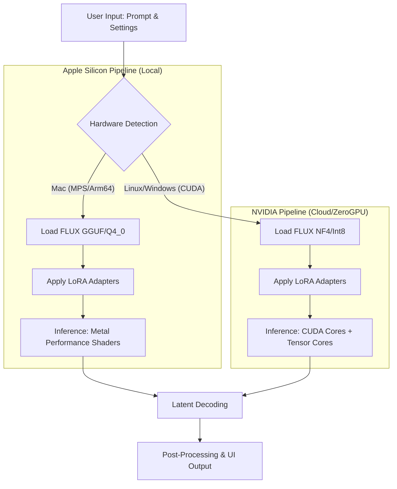

# Hyper-Realism-AI [**FLUX Hyperreality Image Generator]**

> FLUX.1-Krea-dev + FLUX.1-dev

FLUX.1-dev + Super Realism LoRA + Multi-Platform Quantization

### Introduction
A state-of-the-art, hardware-aware Generative AI application designed to bring frontier-class image synthesis to consumer hardware. This project leverages the FLUX.1-dev foundation model, enhanced with Super Realism LoRA adapters, to generate photorealistic imagery with exceptional fidelity.

Crucially, this project implements a hardware-agnostic optimization pipeline. It dynamically adjusts its inference engine based on the available compute substrate—optimizing for Apple Silicon (via MPS/MLX) for local execution and NVIDIA CUDA for cloud deployment (Hugging Face ZeroGPU)—ensuring that hyper-realism is accessible regardless of the hardware constraints.


### Objective
The primary objective of Hyper-Realism-AI is twofold:

Achieve SOTA Visual Fidelity: To utilize the prompt adherence and textural quality of FLUX.1-dev combined with specific LoRA fine-tuning to surpass standard generation quality.

Democratize Large Model Inference: To solve the "VRAM bottleneck" through advanced compression techniques. By implementing Weight Quantization (4-bit/8-bit) and Knowledge Distillation (step-reduction), we aim to run a 12B+ parameter model on a MacBook Air (Edge) and standard Cloud GPUs without Out-Of-Memory (OOM) failures.


## Features

- **Hyper-realistic image generation** using FLUX.1-dev with Super Realism LoRA
- **Multiple quality presets** (8K, 4K, 2K, and Style Zero)
- **Customizable parameters** including dimensions, guidance scale, and inference steps
- **Batch generation** support for up to 5 images simultaneously
- **ZIP download** option for generated image batches
- **Seed control** with randomization option for reproducible results
- **Negative prompting** support for better content control
- **Real-time generation tracking** with timing information


### Methodology & Architecture
To achieve high-performance inference across disparate architectures, we employ a Hybrid Quantization Workflow:

1. **Dynamic Hardware Detection**: The application initiates by detecting the host accelerator (CUDA vs. MPS/CPU).

2. **Selective Quantization**:

- On CUDA (NVIDIA): We utilize NF4 (Normal Float 4) or 8-bit loading via bitsandbytes. This retains near-fp16 dynamic range while halving memory usage, allowing the heavy FLUX transformer to fit alongside the text encoder (T5-XXL).
- On Apple Silicon (Mac): We utilize GGUF format (via diffusers or llama.cpp bindings) or MLX-based quantization. This maps weights directly to Apple's Unified Memory, minimizing swap usage and leveraging the Neural Engine (ANE) where possible.

3. **LoRA Fusion**: The Super-Realism LoRA adapters are fused into the pipeline at runtime to guide the style without altering the base quantized weights.

**Workflow Diagram**


## Requirements

Since, I have Apple Silicon Mac(Macbook air2), I'm looking to build a multi-platform optimization pipeline for this application - ANE(Apple Neuron Engine) optimization for building and running on local(Mac) and NVIDIA CUDA optimization for deploying the application live on Hugging Face(ZeroGPU).


### Dependencies
```
torch
gradio
diffusers
Pillow
numpy
spaces
```


### Interface Components

#### Main Controls
- **Prompt Input**: Enter your image description
- **Run Button**: Generate images based on current settings

#### Quality Styles
- **3840 x 2160**: 8K hyper-realistic output
- **2560 x 1440**: 4K hyper-realistic output  
- **HD+**: 2K hyper-realistic output
- **Style Zero**: Basic prompt without enhancement

#### Advanced Options
- **Negative Prompt**: Specify elements to exclude from generation
- **Seed Control**: Set specific seed or use randomization
- **Dimensions**: Adjust width and height (512-2048px)
- **Guidance Scale**: Control adherence to prompt (0.1-20.0)
- **Inference Steps**: Quality vs speed trade-off (1-40 steps)
- **Batch Size**: Generate 1-5 images simultaneously
- **ZIP Export**: Download all generated images as archive

### Example Prompts

The application includes several example prompts demonstrating effective usage:

1. Professional portrait photography
2. Environmental character shots
3. Studio lighting setups
4. Artistic portrait compositions

## Model Information

- **Base Model**: black-forest-labs/FLUX.1-dev
- **LoRA Enhancement**: strangerzonehf/Flux-Super-Realism-LoRA
- **Trigger Word**: "Super Realism" (automatically prepended)
- **Precision**: bfloat16 for optimal performance

## Configuration

### Style Presets
The application includes predefined style templates that automatically enhance prompts with quality descriptors:
- Ultra-detailed rendering
- Lifelike textures
- High-resolution output
- Sharp focus and vibrant colors
- Photorealistic results

### Default Settings
- Resolution: 1024x1024px
- Guidance Scale: 3.0
- Inference Steps: 30
- Randomized seed enabled
- Single image generation

## Performance Notes

- GPU acceleration required for practical usage
- Generation time varies based on resolution and step count
- Higher inference steps improve quality but increase processing time
- Batch generation processes images sequentially

## File Management

Generated images are automatically saved with unique UUID filenames in PNG format. The ZIP export feature creates compressed archives containing all generated images with sequential naming.

## Troubleshooting

### Common Issues
- **CUDA out of memory**: Reduce image dimensions or batch size
- **Slow generation**: Decrease inference steps or resolution
- **Model loading errors**: Ensure stable internet connection for initial model download

### Performance Optimization
- Use lower guidance scales (2.0-4.0) for faster generation
- Reduce inference steps for quicker results
- Monitor VRAM usage with multiple image generation

## License

This application uses models and components with their respective licenses:
- FLUX.1-dev model licensing applies
- LoRA weights subject to their repository terms
- Application code available for modification and redistribution

## Support

For technical issues or feature requests, refer to the respective model repositories:
- FLUX.1-dev: black-forest-labs/FLUX.1-dev
- Super Realism LoRA: strangerzonehf/Flux-Super-Realism-LoRA


